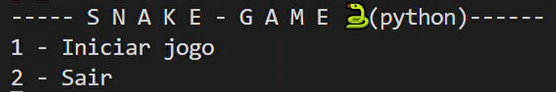
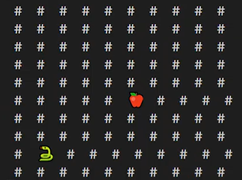

# Snake Game (coded in python🐍)

Hi! In this repository you will gonna find a implementation of SnakeGame coded in python. It is not completed yet. 

Inspired by: [my and a friend´s final project of "Programming Language I", discipline of IT university classes](https://github.com/JulioMelo-Classes/LP1-2022.1-Snaze) -> This link it´s just for _default_ sources

These are the implemented classes:
- SnakeGame
- Player
- Snake
- Level

  

> When it´s running, what you will see:  

 </img>

For now, the maze has no walls, just free spaces for snake to 'run' 